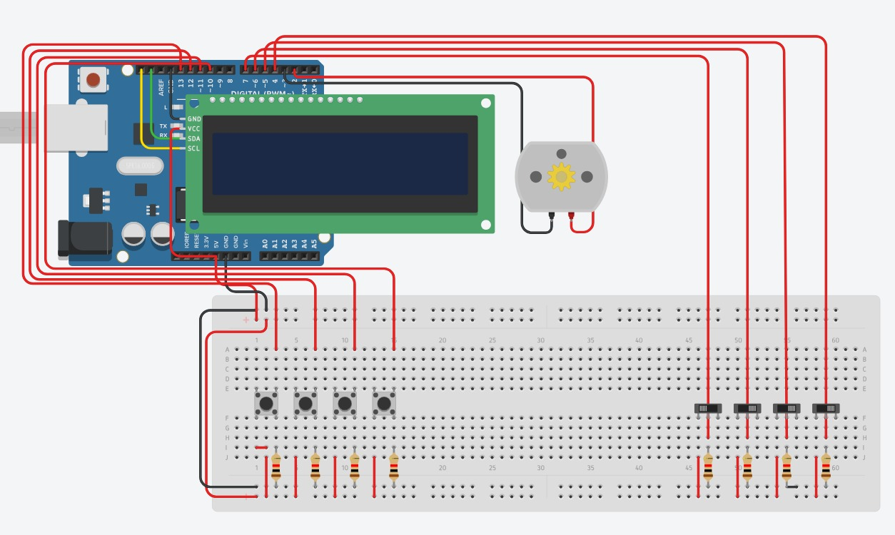

# Arduino Elevator System

  

Arduino-based elevator control system developed to simulate the operation of a multi-floor elevator using buttons, switches, an LCD display and motor direction control.

The project uses push buttons to simulate floor calls and switches to simulate the current floor position of the elevator. The LCD display shows the current floor and movement status, while the motor output pins represent the elevator moving up or down.

## Features

* Floor call system using push buttons
* Floor position simulation using switches
* LCD display showing floor and movement status
* Motor direction control for upward and downward movement
* Logic for ground floor, first floor, second floor and third floor
* Arduino circuit simulation using Tinkercad

## Technologies

* Arduino
* C/C++
* Tinkercad
* LCD Display
* Digital Inputs and Outputs
* Embedded Systems

## Circuit

## How it works

The buttons are used to simulate elevator calls to different floors.
The switches represent the current floor where the elevator is located.
Based on the selected destination and the current floor, the system controls the motor direction and updates the LCD display with messages such as the current floor, "Subindo" or "Descendo".

## How to run

1. Open the project in the Arduino IDE or Tinkercad.
2. Make sure the circuit is connected according to the diagram.
3. Upload or run the code.
4. Use the buttons to select the desired floor.
5. Use the switches to simulate the elevator reaching each floor.

## About the project

This project was developed as a practical electronics and embedded systems exercise, applying concepts of digital inputs, outputs, LCD communication and control logic.
